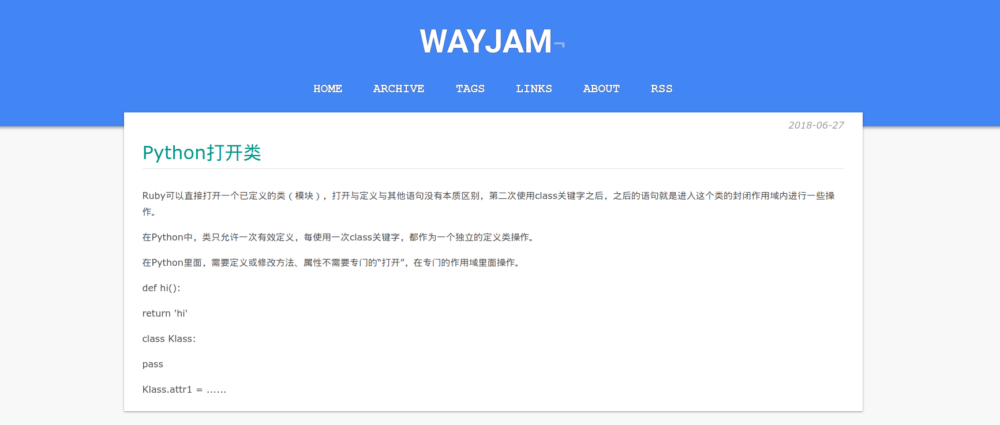

# mixedpaper

A Bitcron Theme.



## Using

Place it into your bitcron template folder, like

```
/path/to/the-name-of-the-site.bitcron.com/template/
```

## License

[](https://opensource.org/licenses/MIT)

This project is licensed under the MIT License - see the [LICENSE.md](LICENSE.md) file for details